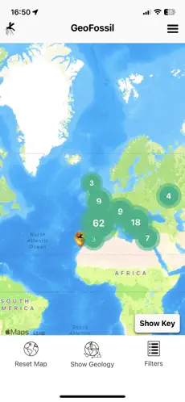
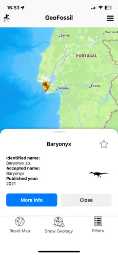
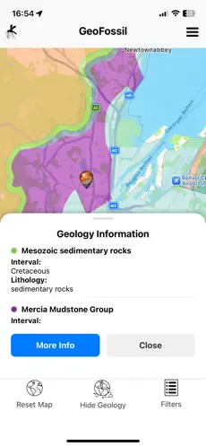

## Hi there 👋 I'm Andrew

😄 Pronouns: They/Them

👀 I’m interested in programming languages, documentation, iOS apps, and palaeobiology.

🌱 I’m currently interested in react-native development.

  📫 You can find me on
  <a href="https://www.linkedin.com/in/andrew-hall-1b54921a2/" rel="nofollow noreferrer" style="display: flex; align-items: center; gap: 4px;">
    
    LinkedIn
  </a>

My main project is GeoFossil on the iOS App Store:

  
  
  

<!--
**AndrewH537/AndrewH537** is a ✨ _special_ ✨ repository because its `README.md` (this file) appears on your GitHub profile.

Here are some ideas to get you started:

- 🔭 I’m currently working on ...
- 🌱 I’m currently learning ...
- 👯 I’m looking to collaborate on ...
- 🤔 I’m looking for help with ...
- 💬 Ask me about ...
- 📫 How to reach me: ...
- 😄 Pronouns: ...
- ⚡ Fun fact: ...
-->
